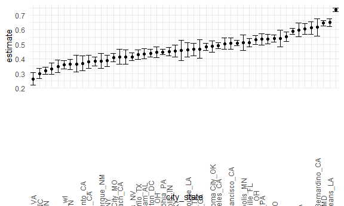

Iteration and listcols
================

## Problem 1

Read in the data.

``` r
urlfile="https://raw.githubusercontent.com/washingtonpost/data-homicides/master/homicide-data.csv"

homicide_df<-read_csv(url(urlfile))
```

    ## 
    ## -- Column specification --------------------------------------------------------
    ## cols(
    ##   uid = col_character(),
    ##   reported_date = col_double(),
    ##   victim_last = col_character(),
    ##   victim_first = col_character(),
    ##   victim_race = col_character(),
    ##   victim_age = col_character(),
    ##   victim_sex = col_character(),
    ##   city = col_character(),
    ##   state = col_character(),
    ##   lat = col_double(),
    ##   lon = col_double(),
    ##   disposition = col_character()
    ## )

``` r
homicide_DF=
homicide_df %>% 
  mutate(
    city_state = str_c (city, state, sep = "_"),
    resolved = case_when(
      disposition == "Closed without arrest" ~ "unsolved" ,
      disposition == "Open/No arrest"        ~ "unsolved" ,
      disposition == "Closed by arrest"      ~ "solved" ,
    )
  ) %>% 
  select(city_state, resolved) %>% 
  filter(city_state != "Tulsa_AL")
```

Let’s look at this a bit

``` r
aggregate_df=
homicide_DF %>% 
  group_by(city_state) %>% 
  summarize(
    hom_total = n(),
    hom_unsolved = sum(resolved == "unsolved")
  )
```

    ## `summarise()` ungrouping output (override with `.groups` argument)

Can I do a prop test for a single city?

``` r
prop.test(
  aggregate_df %>%  filter(city_state == "Baltimore_MD") %>%  pull(hom_unsolved),
    aggregate_df %>%  filter(city_state == "Baltimore_MD") %>%  pull(hom_total)) %>%
   broom ::tidy()
```

    ## # A tibble: 1 x 8
    ##   estimate statistic  p.value parameter conf.low conf.high method    alternative
    ##      <dbl>     <dbl>    <dbl>     <int>    <dbl>     <dbl> <chr>     <chr>      
    ## 1    0.646      239. 6.46e-54         1    0.628     0.663 1-sample~ two.sided

Try to iterate…….

``` r
results_df=
aggregate_df %>% 
  mutate(
    prop_tests = map2(.x = hom_unsolved, .y= hom_total, ~prop.test(x = .x, n= .y)),
    tidy_tests = map(.x= prop_tests, ~broom::tidy(.x))
  ) %>% 
  select(-prop_tests) %>% 
  unnest(tidy_tests) %>% 
  select(city_state, estimate, conf.low, conf.high)
```

``` r
results_df %>% 
  mutate(city_state = fct_reorder(city_state, estimate)) %>% 
  ggplot (aes(x = city_state, y = estimate)) + 
  geom_point() +
  geom_errorbar(aes(ymin = conf.low, ymax=conf.high))+
  theme(axis.text.x = element_text(angle = 90, vjust = 0.5, hjust = -1))
```



``` r
homicide_df=
homicide_df %>% 
  mutate(
    city_state = str_c (city, state, sep = "_"),
    resolved = case_when(
      disposition == "Closed without arrest" ~ "unsolved" ,
      disposition == "Open/No arrest"        ~ "unsolved" ,
      disposition == "Closed by arrest"      ~ "solved" ,
    )
  ) %>% 
  select(city_state, resolved) %>% 
  filter(city_state != "Tulsa_AL")
```

Don’t want to use map?

``` r
city_prop_test = function(df) {
  
  n_solved...
  n_total...
  
  
  prop.test(.....)
  
}


homicide_df %>% 
  nest(data = resolved)
```

    ## # A tibble: 50 x 2
    ##    city_state     data                
    ##    <chr>          <list>              
    ##  1 Albuquerque_NM <tibble [378 x 1]>  
    ##  2 Atlanta_GA     <tibble [973 x 1]>  
    ##  3 Baltimore_MD   <tibble [2,827 x 1]>
    ##  4 Baton Rouge_LA <tibble [424 x 1]>  
    ##  5 Birmingham_AL  <tibble [800 x 1]>  
    ##  6 Boston_MA      <tibble [614 x 1]>  
    ##  7 Buffalo_NY     <tibble [521 x 1]>  
    ##  8 Charlotte_NC   <tibble [687 x 1]>  
    ##  9 Chicago_IL     <tibble [5,535 x 1]>
    ## 10 Cincinnati_OH  <tibble [694 x 1]>  
    ## # ... with 40 more rows

## Problem 2
